# Augusto Moreira Magalhães

Software engineer since 2022 with professional experience across backend, frontend and desktop development. My background spans functional programming in production, around 1.5 years building systems in **Clojure and ClojureScript** at a Central Bank-regulated fintech, through Python-based data tooling and desktop applications at a university research lab (State University of Campinas).

Comfortable working across the stack and picking up new technologies quickly. Interested in full stack development, Data Science/ML, functional programming paradigms and Free and Open-Source Software (FOSS).

📍 Campinas, SP, Brazil · [LinkedIn](https://www.linkedin.com/in/augusto-moreira-magalhaes/) · [HackerRank](https://www.hackerrank.com/augustommg)

---

## Experience Highlights

**Python Developer — UNISIM/CEPETRO, UNICAMP** *(May 2024 – Present)*
Desktop GUI development (PyQt6), REST APIs (FastAPI + Pydantic), data processing and visualization (Pandas, Matplotlib, Plotly), HPC job scheduling (PBS, Slurm), and open source contributions to [Equinor's ERT and Webviz](https://github.com/AugustoMagalhaes/oss-contributions).

**Systems Development Analyst — CSD BR (Fintech)** *(Oct 2022 – Apr 2024)*
Full stack Clojure development on a high-availability financial market infrastructure platform (99.8% uptime). Backend with Ring, Kafka, and CassandraDB; frontend with ClojureScript, Reagent, and Re-frame. Also built Python ETL pipelines and maintained legacy Django/Vue.js systems.

---

## Tech Stack

**Languages**
Python · Clojure / Clojurescript · JavaScript / TypeScript · Bash · SQL

**Functional Programming**
Clojure · ClojureScript · Re-frame · Reagent · Ring

**Backend & APIs**
FastAPI · Pydantic · Django · Flask · Node.js · Express · Sequelize

**Frontend**
React · Redux · Vue.js · Bootstrap · HTML/CSS

**Databases**
CassandraDB · PostgreSQL · MongoDB · MySQL

**Data & Visualization**
Pandas · Matplotlib · Plotly · Dash

**Testing**
Pytest · Selenium · Jest · Mocha · React Testing Library · Cypress

**Infra & Tooling**
Docker · Linux · AWS · Apache Kafka · Git · GitLab · PBS · Slurm

---

## Open Source
I'm interested in open source development and have contributed to production tools used by researchers worldwide. You can check my contributions repository at .

---

# 📊GitHub Stats :

 

